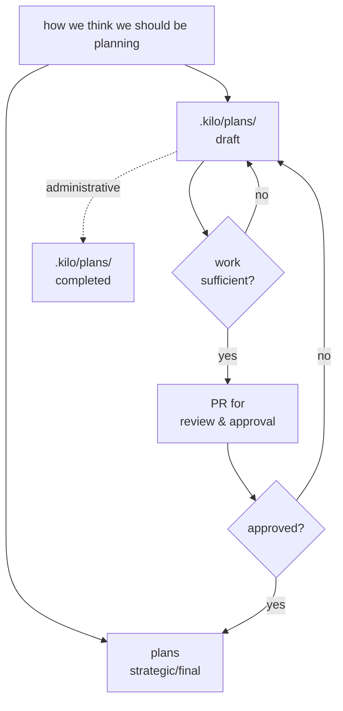
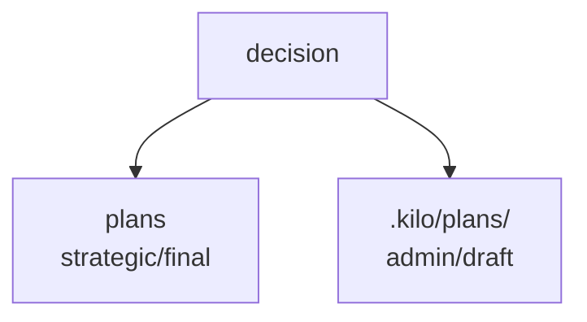
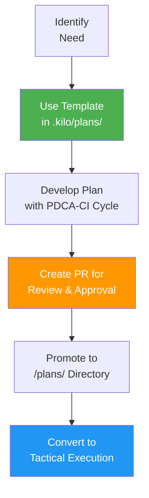

# .kilo/plans Directory

we create plans inside of .kilo/plans using the [template](https://github.com/stellardreams/asi.surge.sh/blob/master/.kilo/plans/template-use-this-template-to-create-plans-under-dot-kilo-plans-folder.md)

see details for next steps below

## Plan Locations in Repository

### Strategic Plans (High-Level → Tactical Execution)
**Location:** [`/plans/`](https://github.com/stellardreams/asi.surge.sh/tree/master/plans) - Main strategic plans directory
- Contains active and evolving strategic plans that need to be converted into tactical execution steps

### Administrative Plans (Work-in-Progress)
**Location:** Current directory (`.kilo/plans/`) - draft planning area
- Contains planning templates and draft plans (see next section for 'Plan Movement & Promotion Process' for high level process overview)

- (`.kilo/plans/`) section is used for creating and refining new initiatives before they are moved to the main [`/plans/`](https://github.com/stellardreams/asi.surge.sh/tree/master/plans) directory

### Plan Movement & Promotion Process

We take the plans from the `.kilo/plans` directory and either:
- **Move them under `.kilo/plans/completed`** (if plan is administrative of a nature)
- **Promote to official plan section** at the following link: [https://github.com/stellardreams/asi.surge.sh/tree/master/plans](https://github.com/stellardreams/asi.surge.sh/tree/master/plans) (after a sufficient amount of work has been under-taken and the PR has been approved)

## Planning Process

### Strategic Plan Development Process

### Key Process Steps

1. **📋 Strategic Plans Location**
   - **High-level strategic plans** that need to be converted into functional tactical execution steps are located in the [`/plans/`](../plans/) folder
   - These represent the canonical, approved strategic direction for the project

2. **🔧 Day-to-Day Work Process**
   - **Create new plans** using the template: [`template-use-this-template-to-create-plans-under-dot-kilo-plans-folder.md`](template-use-this-template-to-create-plans-under-dot-kilo-plans-folder.md)
   - **Develop in this `.kilo/plans/` directory** for initial drafting and refinement
   - **Follow PDCA-CI methodology** (Plan-Do-Check-Act-Continuous Innovation cycle)

3. **🚀 Promotion to Strategic Status**
   - **Anyone wishing to undertake work** must follow this recommendation
   - **Create new [PR](https://github.com/stellardreams/asi.surge.sh/pulls) requests** for proposed work to be reviewed and approved
   - **Approved plans get promoted** from `.kilo/plans/` to `/plans/` directory
   - **Strategic plans become** the foundation for tactical execution steps

## Available Templates & Plans

- **[Planning Template](template-use-this-template-to-create-plans-under-dot-kilo-plans-folder.md)** - Comprehensive template for new plan creation
- **[admin-issue75.md](admin-issue75.md)** - Duplicate strategic plans audit and cleanup plan
- **[mysterious-propulsion.md](mysterious-propulsion.md)** - Advanced propulsion research initiative

## Guidelines

- Use the template for all new plan creation
- Follow PDCA-CI cycle methodology
- Submit PRs for peer review before promotion to strategic status
- Keep administrative work in this directory until approved

---

*For questions about the planning process, see the [main repository README](../../README.md)*