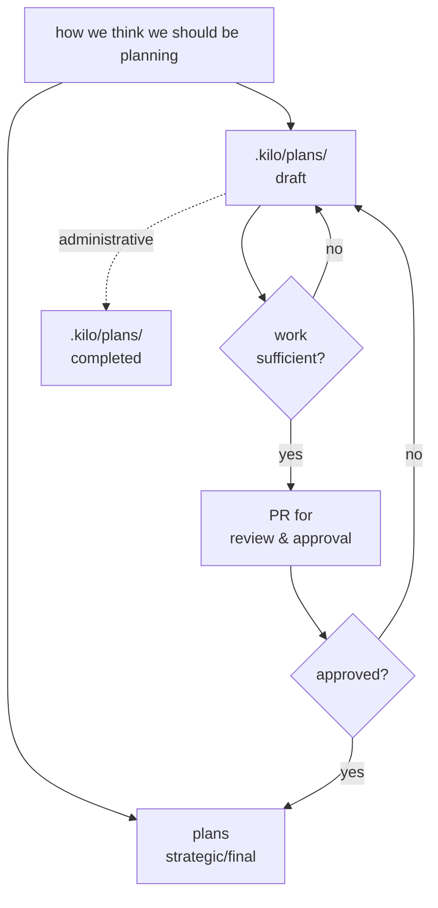
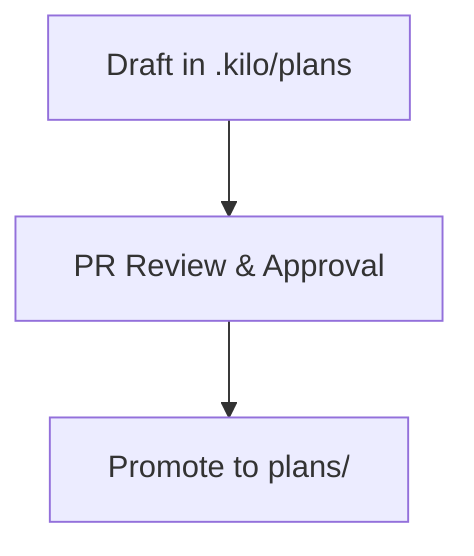
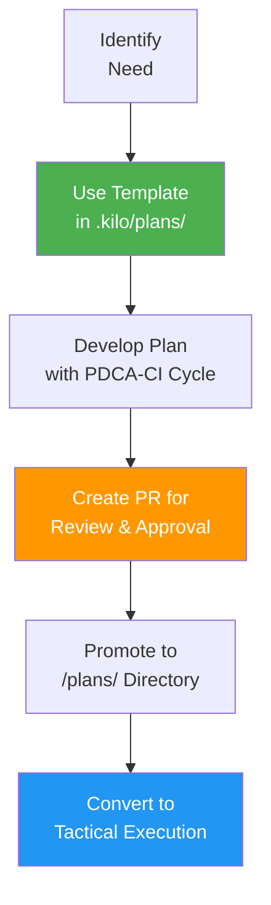

# .kilo/plans Directory

we create plans inside of .kilo/plans using the [template](https://github.com/stellardreams/asi.surge.sh/blob/master/.kilo/plans/template-use-this-template-to-create-plans-under-dot-kilo-plans-folder.md)

see details for next steps below

## Plan Locations in Repository

### Strategic Plans (High-Level → Tactical Execution)
**Location:** [`/plans/`](https://github.com/stellardreams/asi.surge.sh/tree/master/plans) - Main strategic plans directory
- Contains active and evolving strategic plans that need to be converted into tactical execution steps. Plans are promoted to the master `plan/` folder, after a sufficient amount of work has been under-taken and the PR has been approved.

### Administrative Plans (Work-in-Progress)
**Location:** Current directory (`.kilo/plans/`) - draft planning area
- Contains planning templates and draft plans (see next section for 'Plan Movement & Promotion Process' for high level process overview)

> **In a nutshell:** The draft plans from `.kilo/plans` flow to the `plans` folder (as long as the process is followed).

### Administrative Plans

- for administrative plans that don't require promotion to `plans/`, please move to `.kilo/plans/completed`

## Planning Process

### Strategic Plan Development Process

### Let's review the Key Process Steps

> [!Important]
> Anyone wishing to undertake work must follow the recommendations made inside of this Readme. As the project scales, following this process will help ensure that the changes that are most relevant can be interwoven seamlessly.

1. **🔧 Day-to-Day Work Process**
   - **Create new plans** using the template: [`template-use-this-template-to-create-plans-under-dot-kilo-plans-folder.md`](template-use-this-template-to-create-plans-under-dot-kilo-plans-folder.md)
   - **Develop your plan in the `.kilo/plans/` directory** for initial drafting and refinement. And seek active feedback from the other members who are active  in the project
   - Follow **PDCA-CI methodology** (Plan-Do-Check-Act-Continuous Innovation cycle)
   - Follow the **Planning Process** directly above, in order to promote your plan(s) up the chain

2. **📋 Strategic Plans Location**
   - **High-level strategic plans** that need to be converted into functional tactical execution steps are located in the [`/plans/`](https://github.com/stellardreams/asi.surge.sh/tree/master/plans) folder
   - These represent the canonical, approved strategic direction for the project

## Available Templates & Plans

- **[Planning Template](template-use-this-template-to-create-plans-under-dot-kilo-plans-folder.md)** - Comprehensive template for new plan creation
- **[admin-issue75.md](admin-issue75.md)** - leverage this administrative plan via [issue #75](https://github.com/stellardreams/asi.surge.sh/issues/75) in the situation that duplicate or stale plans emerge in the future. The structure inside of this plan and the corresponding issue, will help audit and cleanup the structure.

## Guidelines

- Use the template for all new plan creation
- Follow PDCA-CI cycle methodology
- Submit PRs for peer review before promotion to strategic status
- Completed plans focused on administrative work to be moved to the [`completed` sub-folder here](https://github.com/stellardreams/asi.surge.sh/tree/master/.kilo/plans/completed)

---
