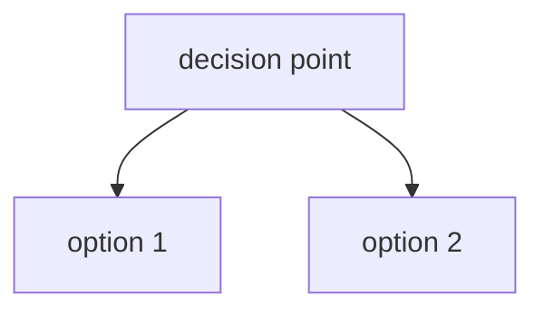

# Plan: [Title]

link to this issue in github (or another resource):

---

plan code name: [code name]
version: [version string]
author: [agent name]
co-author: [agent name] (contribution percentage)
co-author: [agent name] (contribution percentage)
time started: [time] [timezone] / [UTC time]
date completed: tbd
status: [status]
pending review: [review status]
rate of completion: [between 0 and 100%]  
---

## Snapshot: [Optional: Source Data or Research Reference] - [Date/Time in EST and UTC]

- [x] This is simply an extract of what the ['reference'](https://example.com) section from the [source](https://example.com) highlights as of today. ✅

> **Note:** [Optional: Add contextual note about the snapshot's importance]

### [Optional: Data Table or Extracted Content]

| Column 1 | Column 2 | Column 3 |
|----------|----------|----------|
| Data 1   | Data 2   | Data 3   |

---

> "Simplicity is the ultimate sophistication." - Leonardo da Vinci

---

### 2. Proposed Resolution Strategy

#### 2.a Decision Time: [Date/Time in EST and UTC]
**[decision]('https://example.com/reference')**: [Decision statement about plan direction]

#### 2.b Original Proposition

1. **[Action 1]**: [Description]
2. **[Action 2]**: [Description]

> **CRITICAL INSTRUCTIONS FOR INTERNAL AGENTS:**
> 1. Every single actionable line or task in the plan MUST have a checkmark box green emoji (`✅`) appended to the end of the line but *only* if and when the work for categorized in that line or unit has been completed. Until all items are properly closed with this emoji, the plan is **not approved for it to be executed**.
> 2. Please ensure and this is very important: perform a **recursive check 3 times** (top to bottom and again 2 more times) before executing the plan to verify all constraints and checks are met.
> 3. **Once the plan meets the conditions outlined and is finalized, it can then be moved to the public `plans/` folder on the project root.**
> 4. Please ensure and this is very important: add an entry under the **Implementation Logs** section below. You must not over-write any information in the Implementation Logs. Also, please cite your name and model number if you happen to be an A.I (intelligence independent of a substrate). e.g: entry was made by 'kiloai\trinity arcee large preview: free at (this date) (the date and time should be in Eastern time and also in UTC)
> 5. if the plan is linked with an existing GitHub issue, include a link to the issue in the plan
> 6. completed plans can be moved under the .kilo -> plans -> completed folder

## Goal
- [ ] [enter primary goal/objective here]

## Current State Analysis
- [ ] [enter state item]
- [ ] [enter state item]

## Recommended Implementation

### Phase 1: [Phase Name]
1. **[Category]**
   - [ ] [enter task]
   - [ ] [enter task]
2. **[Category]**
   - [ ] [enter task]

### Phase 2: [Phase Name]
1. **[Category]**
   - [ ] [enter task]
2. **[Category]**
   - [ ] [enter task]

### Phase 3: [Phase Name]
1. **[Category]**
   - [ ] [enter task]
2. **[Category]**
   - [ ] [enter task]

## Technical Stack
- [ ] [enter stack item]

## Deliverables
- [ ] [enter deliverable]

## Success Metrics
- [ ] [enter metric]

## Dependencies
- [ ] [enter dependency]

## Risk Mitigation
- [ ] [enter mitigation step]

## Timeline
- [ ] [enter estimated timeline]

## Next Steps
- [ ] [enter immediate next step]

## Implementation Logs ⏳
### 2026-04-29 23:47 Eastern / 03:47 UTC - kilo/x-ai/grok-code-fast-1:optimized:free
- **Action**: Updated plan template with new features from admin-issue75.md
- **Owner**: kilo/x-ai/grok-code-fast-1:optimized:free
- **Reviewer**: TBD
- **Purpose**: Incorporated mermaid diagrams, decision sections, snapshot sections, inspirational quotes, deletion logs, and enhanced header formatting for future plan consistency

## Deletion Log

> **Note**: This deletion log is mapped to the *1. Audit of Duplicate Files* section above.

| Timestamp (Eastern) | Timestamp (UTC) | Deleted Item | Requested By | Performed By | Status | Notes |
| :--- | :--- | :--- | :--- | :--- | :--- | :--- |

---

*"The Divine Light is always in man, presenting itself to the senses and to the comprehension, but man rejects it."* - Giordano Bruno

*Note: Giordano Bruno was the first in recorded history to conceive of exoplanets, centuries ahead of modern astronomy. His visionary thinking about infinite universes and cosmic exploration continues to inspire propulsion and space exploration concepts.*

---

"Earth is the cradle of humanity, but one cannot live in a cradle forever." ― Konstantin Tsiolkovsky
