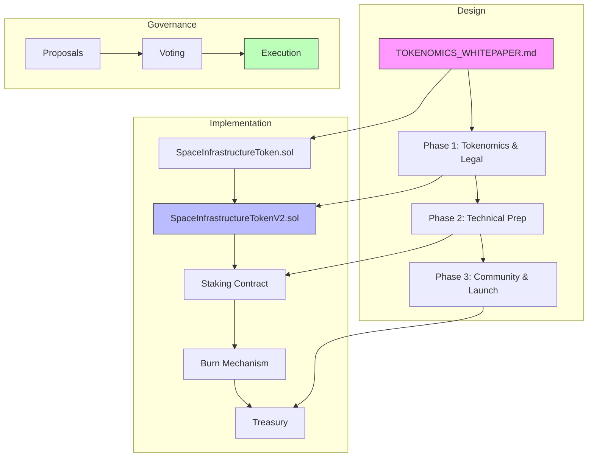
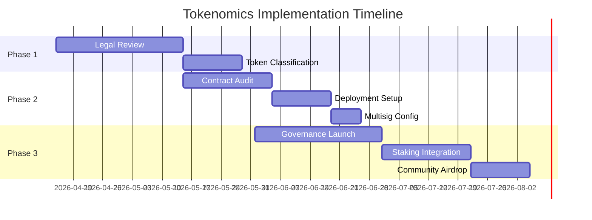
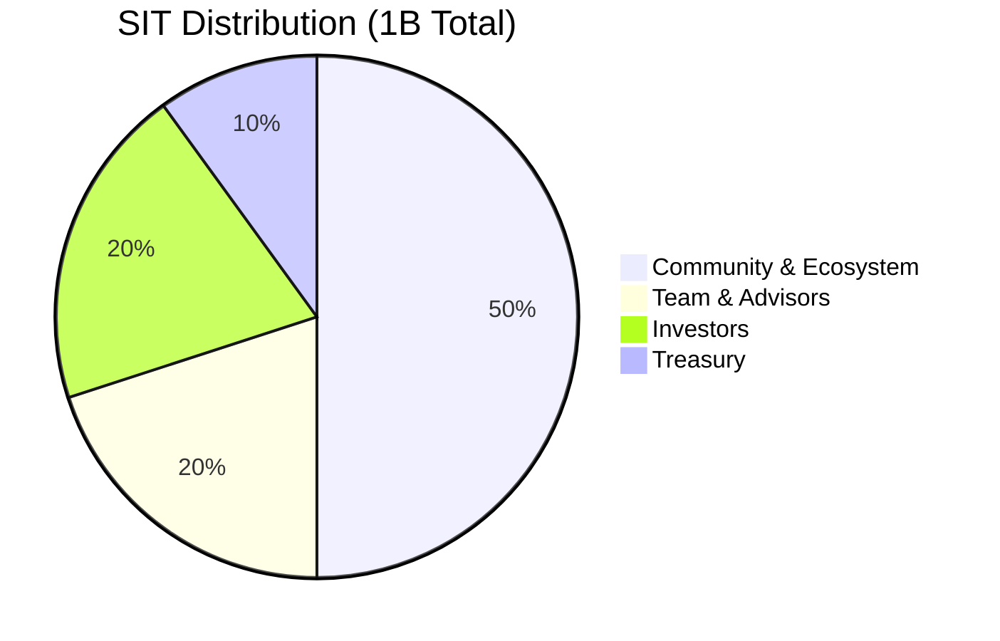

# Plan: swarm management Wikinomics Tokenomics Design <token>

**Issue:** [#49](https://github.com/stellardreams/asi.surge.sh/issues/49)  
**Parent:** [#35 - Blockchain Governance & Transparency](https://github.com/stellardreams/asi.surge.sh/issues/35)
**Blocked by:** [#8](https://github.com/stellardreams/asi.surge.sh/issues/8)

**Requestor:** @genidma  
**Lead Architect:** @genidma  
**Assigned to:** KiloAI

---

## Document Flow

## Implementation Roadmap

## Token Distribution

---

## Context
- Vision: "Wikipedia model" for space infrastructure - anyone can own/co-develop, contributors rewarded for management, maintenance, security, and keeping space accessible
- Current state: Has a governance token contract (`SpaceInfrastructureToken.sol`) with basic ownership and voting
- Non-trivial - requires legal, technical, and community preparation

---

## Completed Work

- [x] **TOKENOMICS_WHITEPAPER.md** - Full tokenomics design created
  - Total Supply: 1,000,000,000 SIT
  - Distribution: 50% Community, 20% Team/Advisors, 20% Investors, 10% Treasury
  - Governance: 1 SIT = 1 vote, 20% quorum
  - Staking rewards with 5% max inflation
  - Deflationary mechanisms (burning)
  - Legal compliance framework (utility token designation)
  - Roadmap: Q2-Q4 2026

---

## Phase 1: Tokenomics & Legal Foundation

- [x] **Tokenomics Design**
  - [x] Total supply: 1,000,000,000 SIT
  - [x] Allocation: 50% Community, 20% Team/Advisors, 20% Investors, 10% Treasury
  - [x] Vesting schedules defined (3-year with 1-year cliff for team)
  - [x] Inflation/reward mechanism (5% max annual, 10% of fees to stakers)

- [ ] **Legal Compliance**
  - [ ] Determine jurisdiction (token classification - utility vs security)
  - [ ] Required disclosures (SAFT, legal opinion, KYC/AML framework)
  - [ ] Token sale legality in chosen jurisdiction
  - *Note: This often requires legal counsel*

- [x] **Token Contract Upgrades**
  - [x] ERC-20 compatibility (documented in enhanced contracts)

---

## Phase 2: Technical Preparation

- [ ] **Smart Contract Audit**
  - [ ] Security audit by third party (critical before any sale)
  - [ ] Fix identified vulnerabilities

- [ ] **Deployment Infrastructure**
  - [ ] Configure for mainnet deployment (Hardhat upgrades plugin)
  - [ ] Set up multisig wallet for admin functions
  - [ ] Timelock controller for governance execution

- [ ] **Frontend/Dashboard**
  - [ ] Token dashboard showing holdings, staking
  - [ ] Governance proposal interface
  - [ ] Contribution tracking and rewards

---

## Phase 3: Community & Launch

- [x] **Documentation**
  - [x] Tokenomics whitepaper (TOKENOMICS_WHITEPAPER.md)
  - [ ] Technical documentation
  - [x] Roadmap and milestone mapping (Q2-Q4 2026)

- [ ] **Launch Mechanics**
  - [ ] Determine sale mechanism (Dutch auction, fair launch, ICO)
  - [ ] Set up token distribution contracts
  - [ ] Community airdrop strategy

---

## Key Questions Before Proceeding

- [x] Token standard: ERC-20 (governance + utility)
- [x] Token use: Governance rights + access + staking + payment
- [ ] Will there be a token sale? (pending legal review)
- [ ] Timeline and budget for legal/security audit?

---

## Next Steps

1. **Legal Review** - Need @genidma input on jurisdiction preference
2. **Contract Implementation** - Move from design to code for vesting/minting
3. **Technical Audit** - Budget and timeline needed
4. **Token Sale Decision** - Pending legal clarity