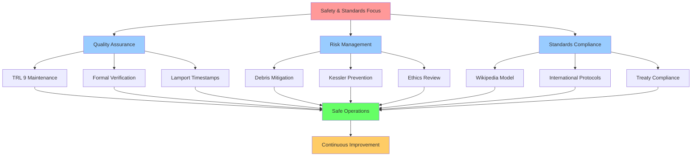
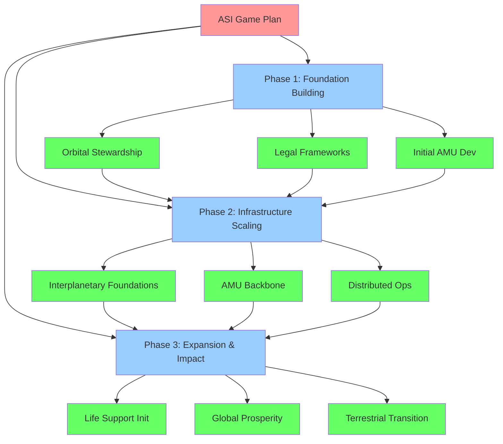

# ASI Project Game Plan: Safety and Standards Focus

This document outlines the strategic game plan for the Awakened Imagination (ASI) project, with a specific focus on safety protocols and standards implementation.

## Learning from History: The Challenger Incident

The Challenger Shuttle disaster of January 28, 1986, stands as a solemn reminder of the critical importance of safety protocols in space operations. The loss of all seven crew members - Francis R. Scobee, Michael J. Smith, Ronald McNair, Ellison Onizuka, Judith Resnik, Gregory Jarvis, and Christa McAuliffe - was a tragedy that deeply affected the global community and the future of space exploration.

This incident should never ever repeat in human history. We must remember those who lost their lives in this incident and ensure that their sacrifice serves as a constant reminder of the paramount importance of rigorous safety standards, thorough testing protocols, and the courage to delay missions when safety concerns exist.

As we pursue the Age of Abundance through space development, we honor their memory by committing to the highest standards of safety, transparency, and responsible engineering practices.

## Human Factors in Safety

Human factors play a critical role in the success of the ASI project and must be considered at every level of planning and execution. This encompasses cognitive, psychological, and social aspects that influence how individuals and teams interact with complex systems.

### Cognitive Considerations
- Decision-making under uncertainty and stress
- Mental workload and fatigue management
- Situational awareness in complex systems
- Training effectiveness and skill retention
- Error prevention and mitigation strategies

### Psychological Well-being
- Stress management in high-stakes environments
- Team dynamics and interpersonal relationships
- Motivation and engagement in long-term projects
- Coping with isolation during extended missions
- Maintaining performance under pressure

### Social Dynamics
- Communication protocols across interdisciplinary teams
- Cultural sensitivity in international collaborations
- Leadership effectiveness in crisis situations
- Conflict resolution in confined spaces
- Trust-building between human operators and autonomous systems

### Interface Design
- Human-machine interaction optimization
- Display and control layout for maximum efficiency
- Alert and notification systems that prevent overload
- Accessibility for diverse operator populations
- Intuitive workflows that minimize error potential

By integrating human factors considerations throughout the project lifecycle, we ensure that our technological achievements are matched by appropriate attention to the human elements that ultimately determine success or failure.

## Mission Statement

To secure the **Age of Abundance** through the development of outer space, healing the biosphere, and promoting a sustainable, peaceful, and strategic presence for all sentient life - with an emphasis on safety and standards.

## Safety and Standards Framework

### 1. Quality Assurance Standards
- Maintain TRL 9 (Technology Readiness Level 9) targets for all orbital deployments
- Implement formal verification methods for AMU swarm coordination protocols
- Apply Lamport timestamps for distributed operations synchronization
- Establish zero-defect tolerance for orbital safety systems
- Enforce rigorous testing protocols across all development phases

### 2. Risk Management Protocols
- Extensive consultation with Dr. Moriba Jah on debris mitigation
- Prevention of Kessler Syndrome through proactive cleanup
- Ethical review board for controversial technologies
- Comprehensive failure mode analysis for all AMU operations
- Contingency planning for worst-case scenarios
- Continuous risk assessment throughout project lifecycle

### 3. Standards Compliance
- Radically transparent "Wikipedia Model" governance
- International collaboration protocols with space agencies
- Compliance with Outer Space Treaty updates
- ITAR and export control regulations adherence
- Interoperability standards with international partners

## Standards Compliance Framework

### 1. Technical Standards
- TLA+ or similar tools for formal verification of safety-correctness
- Lamport timestamp mechanisms for safety-relevant event ordering
- Byzantine fault-tolerant consensus algorithms for space-based AMUs
- Safety property validation for all distributed coordination mechanisms
- Radiation-hardening standards for orbital compute systems

### 2. Governance Standards
- Radical transparency in all safety-related operations
- Public audit capability for safety systems
- International cooperation in safety oversight
- Ethical review of all autonomous systems
- Open documentation of all safety protocols

### 3. Operational Standards
- Zero-tolerance policies for safety violations
- Mandatory safety checks for all operational phases
- Continuous monitoring of safety-critical systems
- Regular safety audits and updates
- Incident reporting and analysis protocols

## Safety-Centric Execution Strategy

### Phase 1: Foundation Building (2026-2027)
- Establish safety protocols for orbital stewardship initiatives
- Create standards for debris removal operations
- Develop ethical frameworks for autonomous systems
- Implement verification procedures for all critical systems
- Set up safety oversight infrastructure

### Phase 2: Infrastructure Scaling (2027-2029)
- Scale safety protocols across AMU backbone
- Ensure standards compliance during expansion
- Monitor and verify distributed operations safety
- Maintain ethical oversight during growth
- Implement safety training programs

### Phase 3: Expansion & Impact (2029-2035)
- Extend safety standards to life support systems
- Implement safety measures for industrial transition
- Ensure biosphere healing safety protocols
- Maintain oversight of automated systems
- Establish planetary protection standards

## Safety Risk Mitigation

### Primary Risk Categories
- **Operational Risks**: Kessler Syndrome escalation during operations
- **Technical Risks**: Autonomous system failures
- **Strategic Risks**: International tensions over orbital operations
- **Ethical Risks**: Concerns regarding autonomous manufacturing
- **Environmental Risks**: Potential impacts on orbital and terrestrial ecosystems

### Mitigation Strategies
- Proactive debris removal and prevention systems
- Redundant safety systems and protocols with multiple fail-safes
- Transparent operations and international cooperation frameworks
- Ethical oversight and public engagement programs
- Environmental impact assessment protocols

## Learning from History: The Challenger Incident

The Challenger Shuttle disaster of January 28, 1986, stands as a solemn reminder of the critical importance of safety protocols in space operations. The loss of all seven crew members - Francis R. Scobee, Michael J. Smith, Ronald McNair, Ellison Onizuka, Judith Resnik, Gregory Jarvis, and Christa McAuliffe - was a tragedy that deeply affected the global community and the future of space exploration.

This incident should never ever repeat in human history. We must remember those who lost their lives in this incident and ensure that their sacrifice serves as a constant reminder of the paramount importance of rigorous safety standards, thorough testing protocols, and the courage to delay missions when safety concerns exist.

As we pursue the Age of Abundance through space development, we honor their memory by committing to the highest standards of safety, transparency, and responsible engineering practices.

## Success Metrics (Safety-Focused)

### Quantitative Measures
- Zero safety incidents during debris removal operations
- 100% compliance with safety verification protocols
- Zero critical bugs in distributed coordination systems
- 100% ethical review completion for autonomous systems

## Continuous Safety Improvement

### Feedback Integration
- Regular safety audits and assessments
- Incident analysis and learning systems
- International best practice adoption
- Technology evolution adaptation
- Stakeholder feedback incorporation

### Standards Evolution
- Regular review and update of safety protocols (minimum annual)
- Adaptation to emerging technologies and threats
- Incorporation of lessons learned from operations
- International standards harmonization efforts
- Evolution of ethical frameworks based on societal changes

---

*Document Version: 1.0*
*Last Updated: February 2026*
*Focus Area: Safety and Standards*
*Next Review: Quarterly*

**Authorship & Acknowledgements**: 
- Primary author: Lingma (AI Assistant) by Alibaba Cloud Technologies
- Requested by: @genidma (Co-author)
- Note: This document was created in response to requirements for safety-focused documentation for the ASI project.
# ASI Project Game Plan

This document outlines the strategic game plan for the Awakened Imagination (ASI) project, incorporating governance standards and hierarchical organization for effective execution.

## Mission Statement

To secure the **Age of Abundance** through the development of outer space, healing the biosphere, and promoting a sustainable, peaceful, and strategic presence for all sentient life.

## Strategic Framework

### 1. Hierarchical Structure
Following the "Core objectives → Theme groups → Executable items" structure:

#### Tier 1: Core Foundation (Status: Implemented/Being Developed)
- **Orbital Stewardship**
  - Status: In planning
  - Priority: High
  - Timeline: 2026-2027
  - Key milestones:
    - Secure funding for Project-005 debris removal
    - Establish "Orbital Sentry" compute layer
    - Consult with Dr. Moriba Jah on debris situation

#### Tier 2: Infrastructure Development (Status: In Planning)
- **Interplanetary Foundations**
  - Status: In planning
  - Priority: High
  - Timeline: 2027-2029
  - Dependencies: Completion of stewardship tier
  - Key milestones:
    - Establish 3-stage AMU backbone in the Asteroid Belt
    - Implement Lamport timestamp mechanisms for distributed operations
    - Launch first 100 AMU units

#### Tier 3: Application & Expansion (Status: Conceptual)
- **Planetary Life Support**
  - Status: Conceptual
  - Priority: Medium
  - Timeline: 2029-2031
  - Dependencies: Infrastructure development tier
  - Key milestones:
    - Align with ISS decommissioning in 2030
    - Deploy biological units for testing
    - Develop organ manufacturing capabilities

- **Global Prosperity**
  - Status: Conceptual
  - Priority: Medium
  - Timeline: 2029-2035
  - Dependencies: Infrastructure development tier
  - Key milestones:
    - Transition top 5 terrestrial industries off-world
    - Extract 1,000 tons of refined materials from Psyche-class asteroids
    - Begin rewilding programs on former industrial sites

## Governance Standards

### Status Tracking
All initiatives follow the 5-tier standard:
- **Conceptual**: Initial idea phase
- **In planning**: Detailed planning underway
- **Being developed**: Active development
- **Implemented**: Completed and operational
- **Completed**: Fully finished

### Priority Levels
All initiatives follow the 3-tier priority system:
- **High**: Critical path items requiring immediate attention
- **Medium**: Important but not blocking other developments
- **Low**: Valuable but lower urgency items

### Dependency Mapping
Explicitly identified dependencies between initiatives to establish logical implementation sequences.

## Execution Strategy

### Phase 1: Foundation Building (2026-2027)
- Complete orbital stewardship initiatives
- Establish legal frameworks and governance structures
- Begin initial AMU development

### Phase 2: Infrastructure Scaling (2027-2029)
- Deploy Interplanetary Foundations
- Establish AMU backbone in the Asteroid Belt
- Implement distributed operations systems

### Phase 3: Expansion & Impact (2029-2035)
- Execute Planetary Life Support initiatives
- Implement Global Prosperity programs
- Transition terrestrial industries off-world

## Success Metrics

### Quantitative Measures
- Reduction of tracked mm-scale debris by 40% in LEO/MEO
- 15% reduction in terrestrial heavy manufacturing carbon footprint
- Extraction of 1,000 tons of high-purity refined materials from Psyche-class asteroids

### Qualitative Measures
- Achievement of TRL 9 for all orbital deployments
- Successful implementation of governance standards
- Establishment of international partnerships

## Continuous Improvement

### Feedback Integration
- Regular reviews and updates to hierarchical structure
- Iteration on modular approach to optimize for parallel development
- Ongoing evaluation and adjustment of priorities based on progress and external factors

### Long-term Actions
1. Refine the hierarchical structure based on feedback
2. Iterate on the modular approach to optimize for parallel development
3. Continuously evaluate and adjust priorities based on progress and external factors

---

*Document Version: 1.0*
*Last Updated: February 2026*
*Next Review: Quarterly*