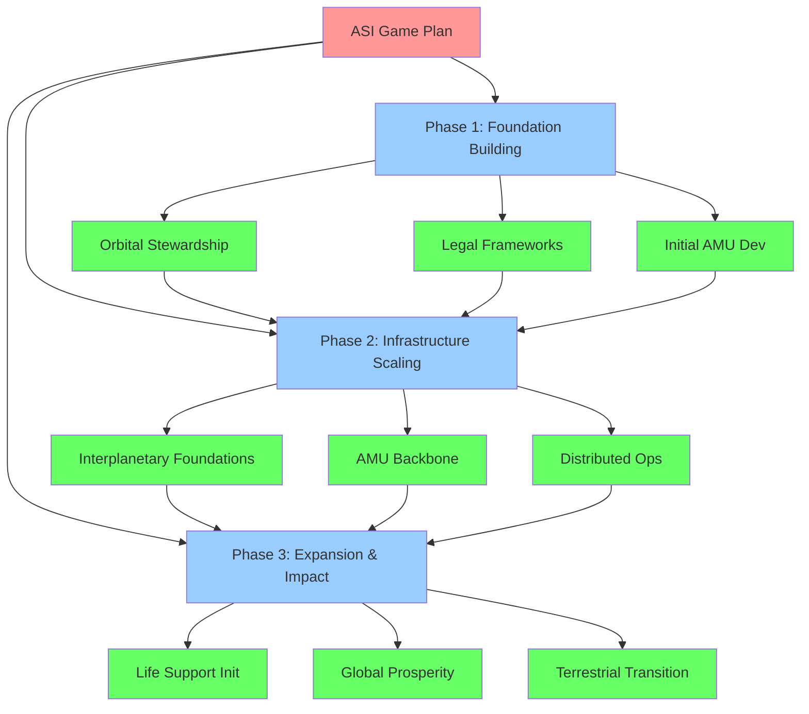

# ASI Project Game Plan

This document outlines the strategic game plan for the Awakened Imagination (ASI) project, incorporating governance standards and hierarchical organization for effective execution.

## Mission Statement

To secure the **Age of Abundance** through the development of outer space, healing the biosphere, and promoting a sustainable, peaceful, and strategic presence for all sentient life.

## Strategic Framework

### 1. Hierarchical Structure
Following the "Core objectives → Theme groups → Executable items" structure:

#### Tier 1: Core Foundation (Status: Implemented/Being Developed)
- **Orbital Stewardship**
  - Status: In planning
  - Priority: High
  - Timeline: 2026-2027
  - Key milestones:
    - Secure funding for Project-005 debris removal
    - Establish "Orbital Sentry" compute layer
    - Consult with Dr. Moriba Jah on debris situation

#### Tier 2: Infrastructure Development (Status: In Planning)
- **Interplanetary Foundations**
  - Status: In planning
  - Priority: High
  - Timeline: 2027-2029
  - Dependencies: Completion of stewardship tier
  - Key milestones:
    - Establish 3-stage AMU backbone in the Asteroid Belt
    - Implement Lamport timestamp mechanisms for distributed operations
    - Launch first 100 AMU units

#### Tier 3: Application & Expansion (Status: Conceptual)
- **Planetary Life Support**
  - Status: Conceptual
  - Priority: Medium
  - Timeline: 2029-2031
  - Dependencies: Infrastructure development tier
  - Key milestones:
    - Align with ISS decommissioning in 2030
    - Deploy biological units for testing
    - Develop organ manufacturing capabilities

- **Global Prosperity**
  - Status: Conceptual
  - Priority: Medium
  - Timeline: 2029-2035
  - Dependencies: Infrastructure development tier
  - Key milestones:
    - Transition top 5 terrestrial industries off-world
    - Extract 1,000 tons of refined materials from Psyche-class asteroids
    - Begin rewilding programs on former industrial sites

## Governance Standards

### Status Tracking
All initiatives follow the 5-tier standard:
- **Conceptual**: Initial idea phase
- **In planning**: Detailed planning underway
- **Being developed**: Active development
- **Implemented**: Completed and operational
- **Completed**: Fully finished

### Priority Levels
All initiatives follow the 3-tier priority system:
- **High**: Critical path items requiring immediate attention
- **Medium**: Important but not blocking other developments
- **Low**: Valuable but lower urgency items

### Dependency Mapping
Explicitly identified dependencies between initiatives to establish logical implementation sequences.

## Safety & Standards Focus

### 1. Quality Assurance
- Maintain TRL 9 (Technology Readiness Level 9) targets for all orbital deployments
- Implement formal verification methods for AMU swarm coordination protocols
- Apply Lamport timestamps for distributed operations synchronization

### 2. Risk Management
- Extensive consultation with Dr. Moriba Jah on debris mitigation
- Prevention of Kessler Syndrome through proactive cleanup
- Ethical review board for controversial technologies

### 3. Standards Compliance
- Radically transparent "Wikipedia Model" governance
- International collaboration protocols with space agencies
- Compliance with Outer Space Treaty updates

## Execution Strategy

### Phase 1: Foundation Building (2026-2027)
- Complete orbital stewardship initiatives
- Establish legal frameworks and governance structures
- Begin initial AMU development

### Phase 2: Infrastructure Scaling (2027-2029)
- Deploy Interplanetary Foundations
- Establish AMU backbone in the Asteroid Belt
- Implement distributed operations systems

### Phase 3: Expansion & Impact (2029-2035)
- Execute Planetary Life Support initiatives
- Implement Global Prosperity programs
- Transition terrestrial industries off-world

## Success Metrics

### Quantitative Measures
- Reduction of tracked mm-scale debris by 40% in LEO/MEO
- 15% reduction in terrestrial heavy manufacturing carbon footprint
- Extraction of 1,000 tons of high-purity refined materials from Psyche-class asteroids

### Qualitative Measures
- Achievement of TRL 9 for all orbital deployments
- Successful implementation of governance standards
- Establishment of international partnerships

## Continuous Improvement

### Feedback Integration
- Regular reviews and updates to hierarchical structure
- Iteration on modular approach to optimize for parallel development
- Ongoing evaluation and adjustment of priorities based on progress and external factors

### Long-term Actions
1. Refine the hierarchical structure based on feedback
2. Iterate on the modular approach to optimize for parallel development
3. Continuously evaluate and adjust priorities based on progress and external factors

---

*Document Version: 1.0*
*Last Updated: February 2026*
*Next Review: Quarterly*