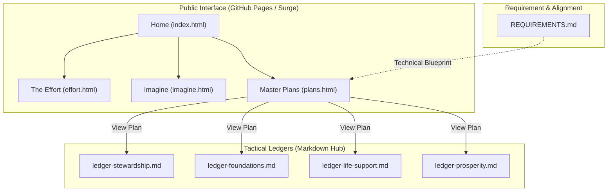

# Awakened Imagination: The Path to Abundance

> **Mission**: To secure the **Age of Abundance** through the development of outer space, healing the biosphere, and promoting a sustainable, peaceful, and strategic presence for all sentient life.

Welcome to the official repository of the **Awakened Imagination Group of Projects**. This site translates high-level orbital development vision into tactical execution logs.

## 🗺️ Project Architecture

The project is structured around four primary pillars, each with a dedicated interactive hub and tactical documentation:

## 🌐 Site Overview

- **[Home](https://asi.surge.sh/)**: The unified mission core and origin story. Highlights our primary areas of interest and technical leadership.
- **[The Effort](https://asi.surge.sh/effort)**: The technical log of iterative development—from autonomous swarm units (AMUs) to deep-space propulsion simulations.
- **[Imagine](https://asi.surge.sh/imagine)**: A visionary workspace visualizing a world where automation, orbital healing, and environmental stewardship have eliminated scarcity.
- **[Master Plans](https://asi.surge.sh/plans)**: The tactical "back of the envelope" strategy for sequential execution (Stewardship → Foundations → Life Support → Prosperity).

## 🚀 Tactical Ledger Integration

The **Plans** page acts as a living bridge between the abstract vision and tactical execution. Every plan card on the site maps directly to a **Tactical Ledger** in this repository:

1.  **[Orbital Stewardship](ledger-stewardship.md)**: Security, hygiene, and debris mitigation (Kessler Syndrome prevention).
2.  **[Interplanetary Foundations](ledger-foundations.md)**: Deep space industrial backbone and Interplanetary Transport Network (ITN).
3.  **[Planetary Life Support](ledger-life-support.md)**: Orbital health span research and bio-scarcity elimination (ISS decommissioning alignment).
4.  **[Global Prosperity](ledger-prosperity.md)**: Transitioning heavy industry off-world to allow Earth's biosphere to heal.

## 🛠️ The Architecture of Abundance (AMUs)

Our foundational technology is the **3-stage AMU (Autonomous Manufacturing Unit)**: 
- **Self-Replication**: Designed for exponential scale.
- **Reorientation**: Capable of on-orbit re-tasking for diverse manufacturing needs.
- **TRL Target**: We are currently bridging the gap from TRL 1 to TRL 9 for orbital deployment.

## 🤝 Join the Effort

This project follows the **Wikipedia Model**—it is a collaborative, radically transparent public benefit ecosystem. We are currently seeking:
- **Lead Ethicists** & **Habitat Designers**
- **Geneticists** & **Astrobiologists**
- **Remote Operations Teams** (Australia/Canada expertise)

Support our mission via [GitHub Sponsors](https://github.com/sponsors/genidma).

---
*Vision co-conceived by [Adeel Khan](https://www.linkedin.com/in/adeelkhan1/)*
