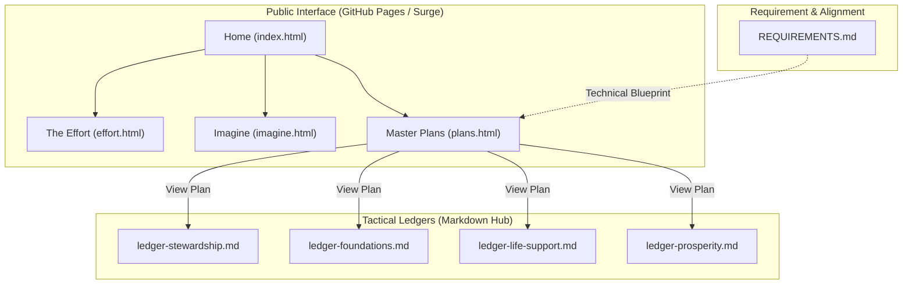

# Awakened Imagination: The Path to Abundance

> **Mission**: To secure the **Age of Abundance** through the development of outer space, healing the biosphere, and promoting a sustainable, peaceful, and strategic presence for all sentient life.

Welcome to the official repository of the **Awakened Imagination Group of Projects**. This site translates high-level orbital development vision into tactical execution logs.

## 🗺️ Project Architecture

The project is structured around four primary pillars, each with a dedicated interactive hub and tactical documentation:


```mermaid
graph TD
    subgraph "Public Interface (GitHub Pages / Surge)"
        A["Home (index.html)"] --> B["The Effort (effort.html)"]
        A --> C["Imagine (imagine.html)"]
        A --> D["Master Plans (plans.html)"]
    end
    
    subgraph "Tactical Ledgers (Markdown Hub)"
        D -->|View Plan| L1["ledger-stewardship.md"]
        D -->|View Plan| L2["ledger-foundations.md"]
        D -->|View Plan| L3["ledger-life-support.md"]
        D -->|View Plan| L4["ledger-prosperity.md"]
    end
    
    subgraph "Requirement & Alignment"
        R["REQUIREMENTS.md"] -.->|Technical Blueprint| D
    end
```

## 🌐 Site Overview

- **[Home](https://asi.surge.sh/)**: main page highlighting the primary areas of interest +
- **[The Effort](https://asi.surge.sh/effort)**: TRL 1 designs of autonomous swarm units (AMUs) and some other designs.
- **[Imagine](https://asi.surge.sh/imagine)**: original vision
- **[Master Plans](https://asi.surge.sh/plans)**: "back of the envelope" plans. 

## 🚀 Tactical Ledger Integration

The **Plans** page acts as a living bridge between the abstract vision and tactical execution. Every plan card on the site maps directly to a **Tactical Ledger** in this repository:

1.  **[Orbital Stewardship](ledger-stewardship.md)**: Security, hygiene, and debris mitigation (Kessler Syndrome prevention).
2.  **[Interplanetary Foundations](ledger-foundations.md)**: Deep space industrial backbone and Interplanetary Transport Network (ITN).
3.  **[Planetary Life Support](ledger-life-support.md)**: Orbital health span research and bio-scarcity elimination (ISS decommissioning alignment).
4.  **[Global Prosperity](ledger-prosperity.md)**: Transitioning heavy industry off-world to allow Earth's biosphere to heal.

## 🏗️ Hierarchical Organization

We've recently restructured the project with a clearer hierarchy to improve navigation and execution:

### Core Tiers
- **Tier 1: Core Foundation** - Essential infrastructure and governance
- **Tier 2: Infrastructure Development** - Building the backbone for operations
- **Tier 3: Application & Expansion** - Implementation and scaling activities

### Status Tracking
Each component tracks its progress with these statuses:
- **Conceptual** - Initial idea phase
- **In planning** - Detailed planning underway
- **Being developed** - Active development
- **Implemented** - Completed and operational
- **Completed** - Fully finished

### Priority Levels
- **High** - Critical path items requiring immediate attention
- **Medium** - Important but not blocking other developments
- **Low** - Valuable but lower urgency items

For detailed roadmap information, see our [ROADMAP.md](ROADMAP.md) file.

## 🛠️ The Architecture of Abundance (AMUs)

Our foundational technology is the **3-stage AMU (Autonomous Manufacturing Unit)**: 
- **Self-Replication**: Designed for exponential scale.
- **Reorientation**: Capable of on-orbit re-tasking for diverse manufacturing needs.
- **TRL Target**: We are currently bridging the gap from TRL 1 to TRL 9 for orbital deployment.

## 🤝 Join the Effort

This project follows the **Wikipedia Model**—it is a collaborative, radically transparent public benefit ecosystem. We are currently seeking:
- **Lead Ethicists** & **Habitat Designers**
- **Geneticists** & **Astrobiologists**
- **Remote Operations Teams** (Australia/Canada expertise)

Support our mission via [GitHub Sponsors](https://github.com/sponsors/genidma).

## 📝 Contributing Guidelines

This is an open-source project and we welcome contributions from the community!

**To get started:**
- Read our **[CONTRIBUTING.md](CONTRIBUTING.md)** for detailed contribution guidelines
- Review our **[CODE_OF_CONDUCT.md](CODE_OF_CONDUCT.md)** to understand our community standards
- Check out the **[issue templates](.github/ISSUE_TEMPLATE/)** for consistent issue reporting
- Use the **[pull request template](.github/PULL_REQUEST_TEMPLATE.md)** when submitting changes

**Note**: We are currently deciding on an open-source license. See the [license decision issue](.github/ISSUE_TEMPLATE/license_decision.md) for details.

## 🏗️ Wikinomics Code Structure

**Disclaimer**: This code has yet to be verified by the project developers.

This repository implements a **decentralized ownership and governance system** for space infrastructure, inspired by Don Tapscott's wikinomics principles. Here's how it works:

### Core Principles

1. **Modularity (The "Bricks" Approach)**: 
   - We focus on creating high-quality, reusable components (or "bricks") that can be easily assembled, tested, and maintained.
   - Each module has a single responsibility and clear interfaces.
   - This approach enables parallel development, easier testing, and better scalability.

2. **Comprehensive Documentation**:
   - All code, configurations, and processes are thoroughly documented.
   - Documentation is written for both humans and AI assistants, ensuring transparency and knowledge transfer.
   - Every module includes: purpose, usage examples, API references, and change logs.

### Implementation Structure

The project follows a decentralized architecture with these key components:

1. **Smart Contracts for Collective Ownership**
   - `contracts/SpaceInfrastructureToken.sol` - Ethereum smart contract for token-based ownership and governance
   - Enables transparent, code-enforced ownership shares and voting rights
   - Anyone can verify and participate in governance

2. **Open Source Collaboration**
   - All hardware designs and software are open source
   - GitHub Actions automatically validate AMU designs (`.github/workflows/validate-designs.yml`)
   - IPFS storage for immutable, versioned blueprints (`scripts/ipfs-storage.js`)
   - Contribution tracking in `package.json` rewards community members with ownership shares

3. **Decentralized Resource Allocation**
   - `scripts/resource-allocator.py` - Transparent resource distribution based on ownership shares
   - Blockchain-based dividend distribution ensures fair compensation
   - All transactions are publicly verifiable

4. **Automated Validation**
   - `scripts/validate-design.js` - Validates AMU designs against technical requirements
   - Ensures quality and safety while enabling open collaboration
   - Design files stored on IPFS for permanent, tamper-proof records

5. **Transparent Governance**
   - Ownership shares grant voting rights on project decisions
   - Proposals and voting are managed through smart contracts
   - All actions are recorded on the blockchain for accountability

This structure enables **true collective ownership** of space infrastructure, where anyone can contribute, own, and govern. The code is fully open source, allowing anyone to verify, fork, or contribute to the project.

### 1. Smart Contracts for Collective Ownership
- `contracts/SpaceInfrastructureToken.sol` - Ethereum smart contract for token-based ownership and governance
- Enables transparent, code-enforced ownership shares and voting rights
- Anyone can verify and participate in governance

### 2. Open Source Collaboration
- All hardware designs and software are open source
- GitHub Actions automatically validate AMU designs (`.github/workflows/validate-designs.yml`)
- IPFS storage for immutable, versioned blueprints (`scripts/ipfs-storage.js`)
- Contribution tracking in `package.json` rewards community members with ownership shares

### 3. Decentralized Resource Allocation
- `scripts/resource-allocator.py` - Transparent resource distribution based on ownership shares
- Blockchain-based dividend distribution ensures fair compensation
- All transactions are publicly verifiable

### 4. Automated Validation
- `scripts/validate-design.js` - Validates AMU designs against technical requirements
- Ensures quality and safety while enabling open collaboration
- Design files stored on IPFS for permanent, tamper-proof records

### 5. Transparent Governance
- Ownership shares grant voting rights on project decisions
- Proposals and voting are managed through smart contracts
- All actions are recorded on the blockchain for accountability

This structure enables **true collective ownership** of space infrastructure, where anyone can contribute, own, and govern. The code is fully open source, allowing anyone to verify, fork, or contribute to the project.

## 📁 Repository Structure

```
asi.surge.sh/
├── contracts/              # Smart contracts for governance
│   └── SpaceInfrastructureToken.sol
├── scripts/                # Utility scripts
│   ├── ipfs-storage.js     # IPFS-based blueprint storage
│   ├── validate-design.js  # Design validation
│   └── resource-allocator.py  # Resource allocation
├── .github/                # GitHub workflows and templates
│   ├── workflows/
│   │   └── validate-designs.yml
│   └── ISSUE_TEMPLATE/
│       ├── bug_report.md
│       ├── feature_request.md
│       ├── license_decision.md
│       └── pull_request.md
├── README.md
├── CONTRIBUTING.md
├── CODE_OF_CONDUCT.md
├── package.json           # Contribution tracking
└── ...
```

## 🛠️ Development Setup

### Prerequisites
- Node.js 18+ and npm
- Docker (optional, for containerized development)

### Installation

1. Clone the repository:
   ```bash
   git clone https://github.com/stellardreams/asi.surge.sh.git
   cd asi.surge.sh
   ```

2. Install dependencies:
   ```bash
   npm install
   ```

3. Compile contracts:
   ```bash
   npx hardhat compile
   ```

### Running Tests

```bash
# Run all tests
npx hardhat test

# Run specific test
npx hardhat test test/SpaceInfrastructureToken.test.js
```

### Local Development with Docker

```bash
# Start development environment
docker-compose up

# Run tests in container
docker-compose run hardhat npm test
```

### Smart Contract Development

- Edit contracts in `contracts/` directory
- Add tests in `test/` directory
- Configure Hardhat in `hardhat.config.js`
- Use OpenZeppelin contracts for security best practices

### Contributing

We welcome contributions from the community! Please follow our [CONTRIBUTING.md](CONTRIBUTING.md) guidelines and review our [CODE_OF_CONDUCT.md](CODE_OF_CONDUCT.md) before submitting pull requests.

---
*Vision co-conceived by [Adeel Khan](https://www.linkedin.com/in/adeelkhan1/)*