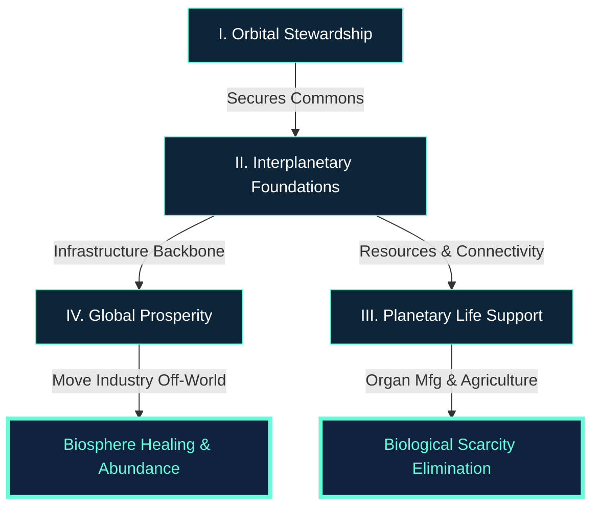

# Requirements Document - Awakened Imagination

## Strategic Overview

This document outlines the core functional and ethical requirements for the Awakened Imagination Ecosystem, as derived from the exhaustive review of the existing vision and technical logs.

## 1. Core Ethos & Governance
- **Status**: Implemented
- **Priority**: High
- **Dependencies**: None
- **Details**:
  - **Wikipedia Model**: All operations must maintain radical transparency.
  - **Interplanetary Legal Framework**: Establishment of the first interplanetary legal common heritage.
  - **Peace Mandate**: Prevention of heavy weaponry in orbital commons; enforcement via universal sanctions.
  - **Humanitarian Focus**: Elimination of scarcity and suffering through abundance.

## 2. Technical Infrastructure & Safety
- **Status**: Being developed
- **Priority**: High
- **Dependencies**: Core Ethos & Governance
- **Details**:
  - **3-Stage AMU Architecture**: Semi-autonomous manufacturing units capable of self-replication.
  - **TRL 9 Target**: Full technology readiness level required for all orbital deployments to avoid "lean-trial" failures.
  - **Orbital Compute Layer**: Blockchain-based "Orbital Sentry" with computer vision (evaluating NVIDIA/Privateer integration).
  - **Logistical Core**: ITN (Interplanetary Transport Network) optimization and SBSP (Space-Based Solar Power) for plummeting energy costs.

## 3. Environmental Stewardship
- **Status**: In planning
- **Priority**: High
- **Dependencies**: Technical Infrastructure & Safety
- **Details**:
  - **Debris Neutralization**: Extensive consultation with Dr. Moriba Jah to avoid Kessler Syndrome.
  - **Earth Healing**: Phase-out of terrestrial heavy manufacturing (e.g., steel/aluminum) in favor of deep-space (ITN) or L4/L5 production.
  - **Orbital Loop**: High-cadence delivery systems (distinguished from Varda Space's focus on LEO re-entry).

## 4. Planetary Life Support
- **Status**: In planning
- **Priority**: Medium
- **Dependencies**: Environmental Stewardship
- **Details**:
  - **ISS Life Extension**: Strategic alignment with ISS decommissioning in 2030 for initial biological unit testing.
  - **Biological Integrity**: Addressing grafting infections and long-term health span in partnership with Knouse Lab and AUH.
  - **Nutrition**: V8 Greenhouse AMUs and collaboration with Svalbard for heritage seed banking.

## 5. Economic & Industrial Evolution
- **Status**: Conceptual
- **Priority**: Medium
- **Dependencies**: Planetary Life Support
- **Details**:
  - **Resource Management**: Tactical management of Psyche-class asteroids; identification of real estate via mapping (consulting Lewicki/PR).
  - **Type III Foundations**: Multi-generational development with input from established visionaries (e.g., Dr. Avi Loeb).
  - **Global Stakeholder Management**: Direct communication with international space agencies to avoid miscommunication in the era of space weaponization.

## 6. Workforce & Talent
- **Status**: Conceptual
- **Priority**: Low
- **Dependencies**: Economic & Industrial Evolution
- **Details**:
  - **Remote Operations**: Leveraging Australian and Canadian expertise in remote and harsh-environment operations.
  - **Synthetic Biology & AI**: High-autonomy alignment for substrate-independent life.

---
*Generated by ASI Gemini for the Awakened Imagination Group of Projects.*
*Synthesized from Issue #7 tactical logs.*