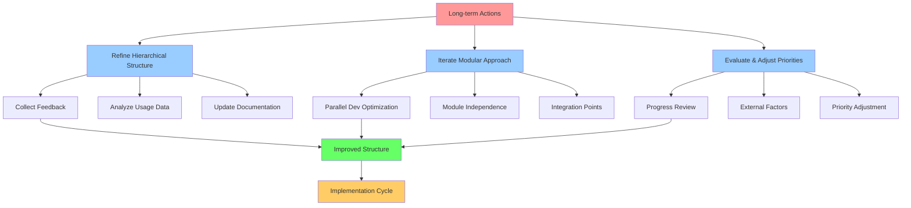

# ASI Project Roadmap

This document provides a visual roadmap showing how different elements of the ASI project relate temporally and hierarchically, based on priority and dependencies.

## Hierarchical Structure

### Tier 1: Core Foundation (Status: Implemented/Being Developed)
- **Orbital Stewardship**
  - Status: In planning
  - Priority: High
  - Timeline: 2026-2027
  - Key milestones:
    - Secure funding for Project-005 debris removal
    - Establish "Orbital Sentry" compute layer
    - Consult with Dr. Moriba Jah on debris situation

### Tier 2: Infrastructure Development (Status: In Planning)
- **Interplanetary Foundations**
  - Status: In planning
  - Priority: High
  - Timeline: 2027-2029
  - Dependencies: Completion of stewardship tier
  - Key milestones:
    - Establish 3-stage AMU backbone in the Asteroid Belt
    - Implement Lamport timestamp mechanisms for distributed operations
    - Launch first 100 AMU units

### Tier 3: Application & Expansion (Status: Conceptual)
- **Planetary Life Support**
  - Status: Conceptual
  - Priority: Medium
  - Timeline: 2029-2031
  - Dependencies: Infrastructure development tier
  - Key milestones:
    - Align with ISS decommissioning in 2030
    - Deploy biological units for testing
    - Develop organ manufacturing capabilities

- **Global Prosperity**
  - Status: Conceptual
  - Priority: Medium
  - Timeline: 2029-2035
  - Dependencies: Infrastructure development tier
  - Key milestones:
    - Transition top 5 terrestrial industries off-world
    - Extract 1,000 tons of refined materials from Psyche-class asteroids
    - Begin rewilding programs on former industrial sites

## Priority Matrix

### High Priority Items
- Ethics Review Board establishment
- Simulation Environment for AMU operations
- Open Source Hardware Designs publication
- Resource Tracking System implementation
- Risk Assessment Matrix development

### Medium Priority Items
- Community Contributions Dashboard
- Collaborative Governance Model
- Metrics & Analytics Dashboard
- Cross-Platform Integration

### Low Priority Items
- Educational Modules development

## Dependencies Map

```
Tier 1: Core Foundation
    ↓ (Required by)
Tier 2: Infrastructure Development  
    ↓ (Required by)
Tier 3: Application & Expansion
    ↓ (Required by)
Long-term Sustainability
```

## Visual Timeline

```
2026-2027    ████████████ Core Foundation
2027-2029    ████████████ Infrastructure Development  
2029-2031         ████████ Planetary Life Support
2029-2035         ████████████ Global Prosperity
2035+                    ████████ Long-term Sustainability

Legend:
█ Active Development
░ Planned Development
○ Milestone/Key Event
```

## Long-term Actions

1. Refine the hierarchical structure based on a. PDCA+CI (continous innovation) and b. feedback and c. teachings by s.blank
2. Iterate on the modular approach to optimize for parallel development
3. Continuously evaluate and adjust priorities based on progress and external factors
4. There should be plans in place, in the situation that the time-lines are crunched. Like an impending catastrophe. However, to manufacture such a catastrophe would not only be highly immoral, but could cause severe problems and potentially irreperable harm on Earth (panic and potential of nuclear war...plus) 



## Implementation Notes

This roadmap follows the recommendations from our [streamlining-suggestions.md](streamlining-suggestions.md) file by:
1. Creating a clear hierarchy with core objectives at the top and supporting ideas underneath
2. Organizing the project into distinct tiers based on dependencies
3. Assigning priority levels to focus efforts on critical elements first
4. Showing temporal relationships between different project elements
5. Identifying dependencies between various components

The roadmap is designed to be a living document that will be updated as the project progresses and as priorities shift based on external factors and internal progress.

---

*Last Updated: February 2026*
*Next Review: Quarterly*
