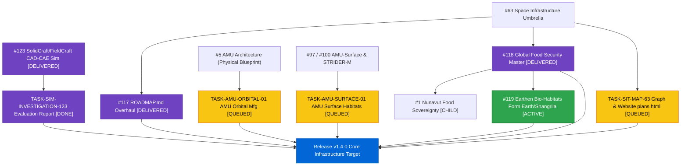

# Forward Engineering Task Tracker (Core Space Infrastructure & AMU Advancements)

> [!TIP]
> ### ❤️ THE WHY: Purpose, Humanity & Impact
> Building open, resilient, and human-affirming space infrastructure—enabling autonomous orbital manufacturing, safe surface habitats, and decentralized resource stewardship without human subjugation or extractive exploitation.

---

## 🎯 Current Operational Focus

```diff
+ ╔════════════════════════════════════════════════════════════════════════════╗
+ ║  ┌──────────────────────────────────────────────────────────────────────┐  ║
+ ║  │ ⏰ TIMESTAMP: 2026-11-03 16:35 EST / 21:35 UTC                       │  ║
+ ║  │ 📌 PRIMARY TARGET: TASK-EARTHEN-HABITAT-119                          │  ║
+ ║  │    Assignee: @genidma, Argon & AGY                                   │  ║
+ ║  │    Branch Sync: main-dev active                                      │  ║
+ ║  │    Active Repo: https://github.com/stellardreams/asi.surge.sh        │  ║
+ ║  │    Deliverable: plans/plan-earthen-bio-habitats.md                   │  ║
+ ║  │    Parent Tracker: #119 (🏺 The New Manna Machine)                    │  ║
+ ║  │    In-Issue Search String ➡️ : 'EARTHEN-HABITAT-119'                  │  ║
+ ║  │    Focus Scope:                                                      │  ║
+ ║  │      • Form Earth continuous slip-form rammed earth envelope (45cm)  │  ║
+ ║  │      • Shangrila-VHP #45 3D earth printer catenary vault modeling    │  ║
+ ║  │      • AMU vertical polyculture core integration (zero insect farm)  │  ║
+ ║  │      • Incorporate SolidCraft/FieldCraft FEA hand-off from #123      │  ║
+ ║  └──────────────────────────────────────────────────────────────────────┘  ║
+ ╚════════════════════════════════════════════════════════════════════════════╝
+ ╔═════════════════════════════════════════════════════╗
+ ║  ┌───────────────────────────────────────────────┐  ║
+ ║  │ 🎯 NEXT PRIORITY 1: TASK-AMU-ORBITAL-01       │  ║
+ ║  └───────────────────────────────────────────────┘  ║
+ ╚═════════════════════════════════════════════════════╝
+ ╔═════════════════════════════════════════════════════╗
+ ║  ┌───────────────────────────────────────────────┐  ║
+ ║  │ 🎯 NEXT PRIORITY 2: TASK-REGOLITH-SAFEGUARD-116│  ║
+ ║  └───────────────────────────────────────────────┘  ║
+ ╚═════════════════════════════════════════════════════╝
+ ╔═════════════════════════════════════════════════════╗
+ ║  ┌───────────────────────────────────────────────┐  ║
+ ║  │ 🎯 NEXT PRIORITY 3: TASK-AMU-SURFACE-01       │  ║
+ ║  └───────────────────────────────────────────────┘  ║
+ ╚═════════════════════════════════════════════════════╝
```

---

### 📋 High-Level Action Checklist

| Priority | Task ID | Description | Status | Target |
| :---: | :--- | :--- | :---: | :--- |
| 🥇 | **TASK-EARTHEN-HABITAT-119** | 🏺 The New Manna Machine (Form Earth slip-form + Shangrila-VHP #45 3D earth + AMU) | 🟢 `ACTIVE` | [#119](https://github.com/stellardreams/asi.surge.sh/issues/119) / `plans/` |
| 🥈 | **TASK-SIM-INVESTIGATION-123** | SolidCraft + FieldCraft pure-Rust CAD/CAE evaluation & Argon hand-off delivered | 🏁 `DONE` | `docs/tech_guide/SOLID_AND_FIELD_CRAFT_EVALUATION.md` / [#123](https://github.com/stellardreams/asi.surge.sh/issues/123) |
| 🥉 | **TASK-AMU-ORBITAL-01** | AMU Orbital manufacturing & in-space automated assembly architectural specification | 🟡 `QUEUED` | `plans/plan-amu-orbital.md` / [#5](https://github.com/stellardreams/asi.surge.sh/issues/5) |
| 4️⃣ | **TASK-REGOLITH-SAFEGUARD-116**| AMU Self-Replication Protocol: In-Situ Asteroid Regolith Manufacturing & Step 0 Safeguard | 🟡 `QUEUED` | [#116](https://github.com/stellardreams/asi.surge.sh/issues/116) / `plans/` |
| 5️⃣ | **TASK-AMU-SURFACE-01** | AMU-Surface habitat modules, regolith utilization & STRIDER-M transporter integration | 🟡 `QUEUED` | `plans/plan-amu-surface.md` / [#100](https://github.com/stellardreams/asi.surge.sh/issues/100) |
| 6️⃣ | **TASK-FOOD-SECURITY-118** | Global Food Security master umbrella architecture specification delivered | 🏁 `DONE` | `plans/plan-food-security.md` / [#118](https://github.com/stellardreams/asi.surge.sh/issues/118) |
| 7️⃣ | **TASK-ROADMAP-UPDATE-117** | Update `ROADMAP.md` with v1.3.3 milestones, decoupled Arctic Wind, and AMU priorities | 🏁 `DONE` | `ROADMAP.md` / [#117](https://github.com/stellardreams/asi.surge.sh/issues/117) |
| 8️⃣ | **TASK-SIT-MAP-63** | Map high-level SIT governance and requirements graph to concrete plans and website `plans.html` | 🟡 `QUEUED` | [#63](https://github.com/stellardreams/asi.surge.sh/issues/63) / `plans.html` |
| 9️⃣ | **CHORE-IDE-DOC-CLEANUP** | Audit, extract, decouple, and sanitize legacy documents, CAD solids, and specifications | 🏁 `DONE` | `scratch/`, `.sys_opt/`, root workspace |

---

### 🏆 Recently Completed Milestones

- [x] **SolidCraft + FieldCraft CAD/CAE Evaluation Delivered (`TASK-SIM-INVESTIGATION-123`)**: Benchmarked pure-Rust CAD/CAE pipeline on Linux x86_64 with zero system library pollution; verified $95.76\%$ FEA convergence against Timoshenko cantilever beam theory; exported AP242 STEP solids; mapped to `cad_and_blender/REGISTRY.md`; and formulated hand-off package for Argon (Gemini 4 Argon). Deliverables documented in `docs/tech_guide/SOLID_AND_FIELD_CRAFT_EVALUATION.md`. Issue #123 kept OPEN pending review. ✅

- [x] **Global Food Security Master Architecture Delivered (`TASK-FOOD-SECURITY-118`)**: Authored [`plans/plan-food-security.md`](plans/plan-food-security.md) bridging closed-loop ECLSS with terrestrial crisis triage (DRC/WFP), linking Nunavut food sovereignty ([#1](https://github.com/stellardreams/asi.surge.sh/issues/1)) and automated earthen bio-habitats ([#119](https://github.com/stellardreams/asi.surge.sh/issues/119)), and establishing a zero-insect-farming biosafety policy. Pushed to `main-dev` (`b02f7d7`) and merged to `main` (`eaaae7a`). Issue #118 kept OPEN pending user review. ✅
- [x] **Roadmap Architecture Overhaul Delivered (`TASK-ROADMAP-UPDATE-117`)**: Overhauled [`ROADMAP.md`](ROADMAP.md) into a comprehensive Tier 0 through Tier 3 hierarchy incorporating delivered engineering assets across Releases `v1.1` through `v1.3.3` (AMU Heritage Orbital `v1.0`, CORA-M `v1.0`, STRIDER-M `v1.0`/`v2.1`, AMU-Surface Habitat `v1.1`, and The New Manna Machine `v1.0`). Pushed to `main-dev` (`da4f947`) and merged to `main` (`eaaae7a`). Issue #117 kept OPEN pending user review. ✅
- [x] **Draft Release Notes v1.3.4 Updated**: Documented repository decoupling, CAD archival, security remediations, and issues #117 / #118 in [`docs/release_notes/v1.3.4-draft.md`](docs/release_notes/v1.3.4-draft.md). ✅
- [x] **IDE Stale Document Cleanup & Audit Sealed (`CHORE-IDE-DOC-CLEANUP`)**: Extracted all actionable engineering specifications into active issues (`#5`, `#100`, `#119`), transferred wind models to upstream repository, archived residual notes and ideas in `_z_archives/`, and audited machine-specific paths with zero public repository exposure. ✅
- [x] **Modular Arctic Wind Upstream Decoupling & Hand-Off**: Decoupled full turbine engineering architecture into [`stellardreams/modular-arctic-wind`](https://github.com/stellardreams/modular-arctic-wind). Verified both branches intact on `main` and `main-dev`. ✅
- [x] **CAD & Spec Archival to `_z_archives`**: Archived `cad_and_blender/freecad/wind/` and wind `.step` exports to [`_z_archives/cad/`](_z_archives/cad/), modernized [`cad_and_blender/REGISTRY.md`](cad_and_blender/REGISTRY.md), archived proposal reviews and foundation/enclosure specs to [`_z_archives/sys_opt/`](_z_archives/sys_opt/). Commits `2703f0c`–`1904196`. ✅
- [x] **Universal TRL Framework**: Published [`docs/tech_guide/TRL_FRAMEWORK.md`](docs/tech_guide/TRL_FRAMEWORK.md) (100% sanitized TRL 1–9 exit gates). Commit `065e482`. ✅
- [x] **🏺 The New Manna Machine (Issue #119 Initial Baseline)**: Delivered architectural plan (`plans/plan-earthen-bio-habitats.md`), parametric OpenSCAD model with multi-tier food production, FreeCAD B-Rep solid model, neutral STEP export, and 360° turntable animations. Interlinked with Master Issue #118. Commits `db7b5a0`–`a19a17b`. ✅
- [x] **Release v1.3.3 (Mini Release)**: Notable Releases table updated with Releases v1.2, v1.3.0–v1.3.3; Aesop philosophy and insect farming exclusion integrated. Commits `87ae2a1`, `9c18457`. ✅

---

## 📋 Task Matrix

### 🟢 Active & Forward Pipeline

| ID | Task Description | Scope / Context | Parent / Origin | Status |
|:---|:---|:---|:---|:---|
| 🔄 **TASK-EARTHEN-HABITAT-119** | **🏺 The New Manna Machine (Earthen Bio-Habitats)** | Design dual-tier rammed earth (Form Earth) + self-replicating adobe printer (Shangrila-VHP #45) + AMU controlled polyculture shell with sub-zero alkali geopolymers. | • Tracked in: [#119](https://github.com/stellardreams/asi.surge.sh/issues/119)<br>• Parent: [#118](https://github.com/stellardreams/asi.surge.sh/issues/118) | 🟢 `ACTIVE` |
| 🏁 **TASK-SIM-INVESTIGATION-123** | **SolidCraft + FieldCraft CAD/CAE Evaluation** | Pure-Rust CAD/CAE evaluation (Tangency Labs), headless CLI, STEP workflow, MCP agent integration, and FEA benchmark for robotics & habitats. | • Tracked in: [#123](https://github.com/stellardreams/asi.surge.sh/issues/123)<br>• Target: `docs/tech_guide/SOLID_AND_FIELD_CRAFT_EVALUATION.md` | 🏁 `DONE` |
| 🔄 **TASK-AMU-ORBITAL-01** | **AMU Orbital Manufacturing Architecture** | Formulate autonomous in-space fabrication, beam welding, toolhead changer, microgravity metallurgy, and MIL-STD-461G 360° braided cryogenic umbilical harness specifications. | • Tracked in: [#5](https://github.com/stellardreams/asi.surge.sh/issues/5)<br>• Target: `plans/plan-amu-orbital.md` | 🟡 `QUEUED` |
| 🔄 **TASK-REGOLITH-SAFEGUARD-116**| **AMU Regolith Self-Replication & Step 0 Gate** | Define asteroid regolith vacuum refining/sintering and astrobiological lifeform intercept roadblock state machines. | • Tracked in: [#116](https://github.com/stellardreams/asi.surge.sh/issues/116)<br>• Target: `plans/` | 🟡 `QUEUED` |
| 🔄 **TASK-AMU-SURFACE-01** | **AMU-Surface Habitat Modules** | Define pressurized surface modules, regolith sintering / shielding shells, airlock interfaces, STRIDER-M sub-zero deck latches, and extreme NEMA 4X / IP68 enclosures. | • Parent Trackers: [#97](https://github.com/stellardreams/asi.surge.sh/issues/97) (Closed), [#100](https://github.com/stellardreams/asi.surge.sh/issues/100) (Open)<br>• Target: `plans/plan-amu-surface.md` | 🟡 `QUEUED` |
| 🏁 **TASK-FOOD-SECURITY-118** | **Global Food Security & Terrestrial AMU** | Coordinate high-latitude food sovereignty (Nunavut #1) and rapid crisis nutrition deployment (DRC, WFP). | • Tracked in: [#118](https://github.com/stellardreams/asi.surge.sh/issues/118)<br>• Child: [#1](https://github.com/stellardreams/asi.surge.sh/issues/1) | 🏁 `DONE` |
| 🏁 **TASK-ROADMAP-UPDATE-117** | **ROADMAP.md Architecture & Milestones** | Overhaul `ROADMAP.md` to incorporate delivered v1.1–v1.3.3 hardware/cad registries, Arctic Wind decoupling, and AMU priorities. | • Tracked in: [#117](https://github.com/stellardreams/asi.surge.sh/issues/117)<br>• Target: `ROADMAP.md` | 🏁 `DONE` |
| 🔄 **TASK-SIT-MAP-63** | **SIT High-Level Graph Reconciliation** | Re-link graph nodes to targeted plan files and update the live website's `plans.html` showcase. | • Tracked in: [#63](https://github.com/stellardreams/asi.surge.sh/issues/63)<br>• Target: `plans.html` & `plans/` | 🟡 `QUEUED` |
| ⏸️ **TASK-TRL-READING** | **Universal TRL 1–9 Engineering Reference Track** | Review universal TRL 1–9 definitions and exit gates for maintainer reference. | • Target: [`docs/tech_guide/TRL_FRAMEWORK.md`](docs/tech_guide/TRL_FRAMEWORK.md) | ⏸️ `LOW_PRIORITY` |
| 🏁 **CHORE-IDE-DOC-CLEANUP** | **IDE Stale Document Cleanup & Audit** | Audit, archive or prune stale documents, scratch comments, legacy review drafts, and unreferenced artifacts inside the IDE workspace. | • Tracked in: `forward_tasks.md` (no GH ticket; logged across both repos)<br>• Target: `scratch/`, `.sys_opt/`, root workspace | 🏁 `DONE` |

---

## 🔍 Task Hierarchy & Lineage

### 📊 Visual Dependency Flow (Mermaid.js)


```mermaid
graph TD
    I123["#123 SolidCraft/FieldCraft CAD-CAE Sim [DELIVERED]"] --> T123["TASK-SIM-INVESTIGATION-123 Evaluation Report [DONE]"]
    
    I63["#63 Space Infrastructure Umbrella"] --> I117["#117 ROADMAP.md Overhaul [DELIVERED]"]
    I63 --> I118["#118 Global Food Security Master [DELIVERED]"]
    I118 --> I01["#1 Nunavut Food Sovereignty [CHILD]"]
    I118 --> I119["#119 Earthen Bio-Habitats Form Earth/Shangrila [ACTIVE]"]

    I05["#5 AMU Architecture (Physical Blueprint)"] --> O01["TASK-AMU-ORBITAL-01 AMU Orbital Mfg [QUEUED]"]
    I97["#97 / #100 AMU-Surface & STRIDER-M"] --> S01["TASK-AMU-SURFACE-01 AMU Surface Habitats [QUEUED]"]
    I63 --> M63["TASK-SIT-MAP-63 Graph & Website plans.html [QUEUED]"]
    
    T123 --> V140["Release v1.4.0 Core Infrastructure Target"]
    O01 --> V140
    S01 --> V140
    I117 --> V140
    I118 --> V140
    I119 --> V140
    M63 --> V140

    classDef active fill:#2ea44f,stroke:#22863a,stroke-width:2px,color:#fff;
    classDef queued fill:#f9c513,stroke:#e36209,stroke-width:1px,color:#000;
    classDef target fill:#0366d6,stroke:#005cc5,stroke-width:1px,color:#fff;
    classDef done fill:#6f42c1,stroke:#5a32a3,stroke-width:1px,color:#fff;

    class I123 done;
    class T123 done;
    class I119 active;
    class S01 queued;
    class O01 queued;
    class I117 done;
    class I118 done;
    class M63 queued;
    class V140 target;
```

---

## 📌 Initiative Metadata & Lineage

> **Status:** Active  
> **Environment:** Google Antigravity (AGY)  
> **Active Branch:** `main-dev` (synced at `eaaae7a`)  
> **Parent Initiatives:** [#5](https://github.com/stellardreams/asi.surge.sh/issues/5), [#63](https://github.com/stellardreams/asi.surge.sh/issues/63), [#100](https://github.com/stellardreams/asi.surge.sh/issues/100), [#116](https://github.com/stellardreams/asi.surge.sh/issues/116), [#117](https://github.com/stellardreams/asi.surge.sh/issues/117), [#118](https://github.com/stellardreams/asi.surge.sh/issues/118), [#119](https://github.com/stellardreams/asi.surge.sh/issues/119), [#123](https://github.com/stellardreams/asi.surge.sh/issues/123)  
> **Slated for Release:** `v1.3.4` (currently in draft)  
> **Target Release:** `v1.4.0` (Core Space Infrastructure)
