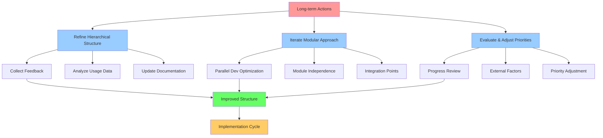

# Suggestions for Streamlining the ASI Project Plans

Note: work effort tracked in [issue 38](https://github.com/stellardreams/asi.surge.sh/issues/38)

## Current Complexity Issues

The ASI project plans have become increasingly complex with multiple interconnected elements, making it difficult to prioritize and execute effectively.

## Proposed Streamlining Approaches

### 1. Hierarchical Organization
Create a clearer hierarchy with core objectives at the top and supporting ideas underneath. This would involve grouping related ideas into themes (e.g., "Infrastructure", "Governance", "Partnerships").

### 2. Modular Approach
Break down the master plan into smaller, more manageable modules that can be worked on independently but still contribute to the overall vision.

### 3. Status Tracking
Add a "Status" column to track which ideas are:
- Conceptual
- In planning
- Being developed
- Implemented
- Completed

### 4. Priority Levels
Introduce priority levels (High/Medium/Low or numerical) to help focus efforts on the most critical elements first.

### 5. Dependency Mapping
Show which ideas depend on others being completed first, so we can establish a more logical sequence of implementation.

### 6. Thematic Clustering
Group related ideas together and create thematic subsections within the document.

### 7. Visual Roadmap
Consider adding a visual timeline or roadmap that shows how different elements relate temporally.

### 8. Remove Redundancies
Identify and consolidate overlapping ideas to reduce complexity.

### 9. Focus on MVP
Identify a minimum viable product/set of features that captures the core value proposition.

## Implementation Recommendations

### Immediate Actions
1. Add status and priority fields to the existing ideas table
2. Group related ideas into thematic clusters
3. Identify dependencies between ideas

### Medium-term Actions
1. Create a visual roadmap based on priority and dependencies
2. Develop modules that can be worked on independently
3. Establish clear completion criteria for each idea

### Long-term Actions
1. Refine the hierarchical structure based on feedback
2. Iterate on the modular approach to optimize for parallel development
3. Continuously evaluate and adjust priorities based on progress and external factors

These changes would help transform the complex planning structure into a more actionable and navigable roadmap for the ASI project.
